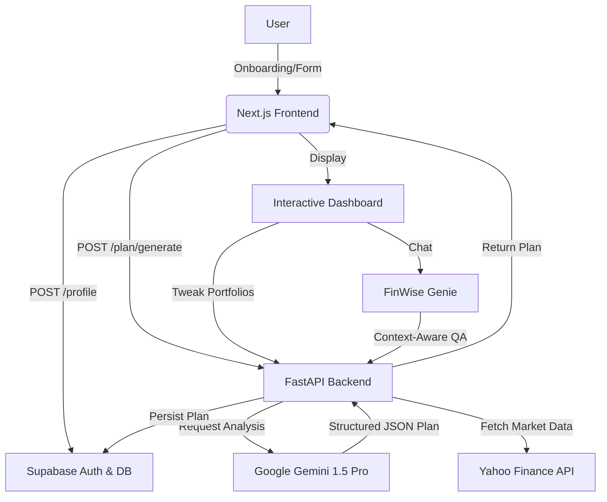

# FinWise Teen 💰

> **AI-Powered Financial Planning for the Next Generation of India.**  
> Built for teenagers and young adults to start their wealth journey with data-driven, personalised investment plans.

FinWise Teen simplifies the complex world of personal finance for young Indians. By entering your income, expenses, and life ambitions, our **Google Gemini-powered AI** generates a sophisticated investment strategy across 8+ asset classes, including stocks, mutual funds, gold, bonds, REITs, and more — all tailored to the Indian economic context.

---

## ✨ Features

- **🤖 AI-Driven Personalisation**: Uses Gemini 1.5 Pro to create bespoke portfolios based on your unique risk profile and goals.
- **📊 Interactive Wealth Projection**: Visualise your financial future with live compounding simulations (adjusted for inflation & taxes).
- **🕹️ Gamified Finance**: Earn digital badges like "Emergency Expert" and "High Flyer" as you reach financial milestones.
- **⚖️ Dynamic Tweak Sliders**: Adjust your allocation in real-time and see how it impacts your long-term wealth.
- **🛡️ Emergency Fund "Runway"**: A dedicated "Survival Timer" showing exactly how many months your savings will cover.
- **📈 Live Market Pulse**: Real-time tracking of NIFTY 50, SENSEX, Gold, and 10Y Bond yields via Yahoo Finance.
- **🧞‍♂️ FinWise Genie**: A context-aware AI chatbot that knows your specific plan and answers your financial queries.
- **🔗 Smart Sharing & QR**: Generate a public shareable link and a **QR Code** to show off your financial plan.

---

## 🏗️ Technical Architecture

### System Flow


### Component Breakdown
- **Frontend**: Next.js 14, TypeScript, Tailwind CSS, Framer Motion, Recharts.
- **Backend**: FastAPI, Pydantic (v2), Uvicorn.
- **Database**: Supabase (PostgreSQL, Auth).
- **AI/ML**: Google Generative AI (Gemini SDK).

---

## 🚀 Getting Started

### Prerequisites
- **Node.js**: 18.x or higher
- **Python**: 3.10.x or higher
- **Supabase Account**: A project with `user_profiles` and `investment_plans` tables.
- **Gemini API Key**: From [Google AI Studio](https://aistudio.google.com).

### 1. Configuration

**Backend (`/` root)**: Create a `.env` file:
```env
GEMINI_API_KEY=your_key_here
SUPABASE_URL=your_supabase_url
SUPABASE_KEY=your_service_role_or_anon_key
```

**Frontend (`/frontend`)**: Create a `.env.local` file:
```env
NEXT_PUBLIC_SUPABASE_URL=your_supabase_url
NEXT_PUBLIC_SUPABASE_ANON_KEY=your_anon_key
NEXT_PUBLIC_API_BASE_URL=http://localhost:PORT_NUMBER/api/v2
```

### 2. Installation & Execution

#### Backend (FastAPI)
```powershell
# From the root directory
python -m venv venv
.\venv\Scripts\activate
pip install -r requirements.txt
python run_api.py
```
*API will be live at `http://localhost:PORT_NUMBER/api/v2`*

#### Frontend (Next.js)
```powershell
# From the /frontend directory
npm install
npm run dev
```
*App will be live at `http://localhost:PORT_NUMBER`*

---

## 📁 Project Structure

```text
FinWise-Teen/
├── frontend/                  # Next.js Application
│   ├── app/                   # App Router (Dashboard, Onboarding, Profile)
│   ├── components/            # UI Components (Genie, MarketPulse, Charts)
│   ├── lib/                   # Utils, Supabase Client
│   └── public/                # Assets & Icons
├── src/                       # Backend Logic
│   ├── api/                   # FastAPI Routes & Models
│   ├── ingestion/             # Data processing (market data)
│   └── risk/                  # Risk assessment logic
├── run_api.py                 # Backend Entry Point
├── supabase_schema.sql        # DB Initialization Script
└── requirements.txt           # Python Dependencies
```

---

## 🔌 API Reference

| Endpoint | Method | Description |
|---|---|---|
| `/api/v2/health` | `GET` | System health check & Gemini status. |
| `/api/v2/plan/generate` | `POST` | Generates a new AI investment plan. |
| `/api/v2/plan/{userId}/latest` | `GET` | Fetches the most recent plan for a user. |
| `/api/v2/chat` | `POST` | AI Chatbot endpoint (Plan-aware). |
| `/api/v2/market/pulse` | `GET` | Live indices and commodity prices. |

---

## ⚖️ Disclaimer
*FinWise Teen is an educational tool. All investment plans are generated by AI and do not constitute professional financial advice. Always perform your own research or consult a SEBI-registered advisor before investing.*
